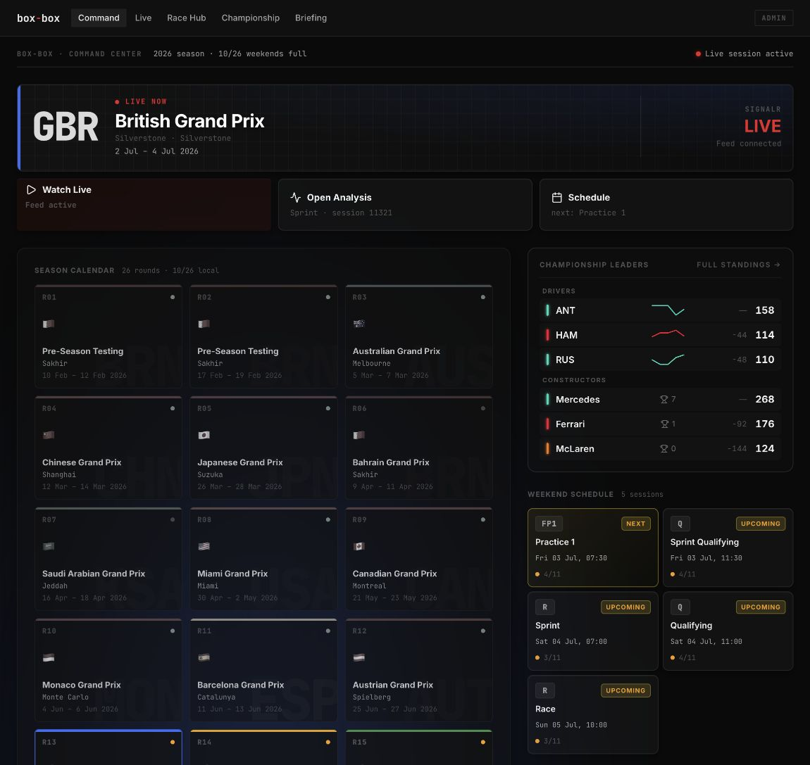

# box-box

> "Box, box. Box, box." Every F1 race engineer, ever.

**box-box** is an unofficial F1 race-weekend command center: live timing, Race Hub analytics, championship context, paddock briefing feeds, and local historical data in one Go + React app, with a preserved Bubble Tea TUI.

Live demo: [box-box.amantahiliani.com](https://box-box.amantahiliani.com/)



## What it does

- **Command Center**: current race-weekend home with GP identity, live status, schedule, championship leaders, and direct analysis links.
- **Race Hub**: session workspace for overview, race story, strategy, laps, weather, race control, and dataset coverage.
- **Live Timing**: official F1 SignalR feed bridged through the Go server to the browser via SSE.
- **Championship View**: standings, form, teammate context, cumulative points, and a simulator.
- **Paddock Briefing**: RSS/Atom news ingestion for a local race-weekend briefing surface.
- **Local-first history**: OpenF1 data ingested into a SQLite domain database for fast historical browsing.
- **Terminal Mode**: Bubble Tea TUI with standings, calendar, driver profiles, live timing, track map, battles, pit window, and replay.

## Status

Pre-beta and actively developed. The Web UI is the primary surface; the TUI is preserved and still useful for terminal workflows. Live timing depends on F1 broadcasting timing data, so it is only fully active during live sessions.

## Quickstart

```bash
git clone https://github.com/AmanTahiliani/box-box.git
cd box-box

npm install                    # Playwright and repo-level test scripts
npm install --prefix frontend  # Vite + React app

npm run build --prefix frontend
go run ./cmd/main.go --web
# http://localhost:8080
```

For frontend development with a seeded local database:

```bash
go run ./scripts/seed-e2e-db/main.go --db /tmp/boxbox-dev.db
BOXBOX_DISABLE_LIVE=1 go run ./cmd/main.go --web --db /tmp/boxbox-dev.db --port 18080

BOXBOX_API_PORT=18080 npm run dev --prefix frontend
# http://localhost:5173
```

## Architecture

| Layer | Role |
| --- | --- |
| **OpenF1 REST** | Backfill and ingestion source; optional paid tier via `OPENF1_API_KEY`. Also powers the TUI’s on-demand reads and HTTP cache. |
| **Domain SQLite** (`boxbox.db`) | Local store for meetings, sessions, Race Hub datasets, and navigation APIs used by the Web UI. |
| **HTTP cache SQLite** (`cache.db`) | TTL cache for OpenF1 responses (TUI and legacy paths). Separate from the domain DB. |
| **Official F1 SignalR** | Live timing bridge in `internal/live`, exposed to Web (SSE) and TUI. |
| **Go server** | `cmd/main.go`: TUI, `--web` API + static SPA, or CLI ingestion. |
| **React frontend** | `frontend/`: production build served from `frontend/dist` when present. |

The Web UI should call **local-first Go APIs** (`/api/v1/...`). Do not add direct OpenF1 reads in the frontend.

For architecture, phase history, and design rationale, see [documentations/refactor/README.md](documentations/refactor/README.md).

## Prerequisites

- [Go](https://go.dev/doc/install) (see `go.mod` for the module version)
- [Node.js](https://nodejs.org/) 18+ and npm (Web UI dev, unit tests, Playwright)
- Internet for ingestion and TUI OpenF1 calls
- For E2E / visual tests: `npx playwright install` (Chromium) after `npm install` at the repo root

## Install

```bash
git clone https://github.com/AmanTahiliani/box-box.git
cd box-box

npm install                    # Playwright and repo-level test scripts
npm install --prefix frontend  # Vite + React app
```

## Build

```bash
go build -o box-box ./cmd/main.go
npm run build --prefix frontend   # writes frontend/dist (gitignored)
```

## Run: TUI (default)

```bash
go run ./cmd/main.go
# or: ./box-box
```

Logs go to `box-box.log` in the project directory so the terminal stays clean.

### TUI keybindings

| Key | Action |
| --- | --- |
| `1`-`7` | Home, Standings, Calendar, Race Detail, Drivers, Live, Track Map |
| `tab` / `shift+tab` | Next / previous tab |
| `j`/`k`, `enter`, `b`/`esc` | Navigate, select, back |
| `s`, `b`, `p` | Live: sectors, battles, pit window |
| `r` | Race replay (Race Detail, race sessions) |
| `y` | Cycle season year |
| `q` / `ctrl+c` | Quit |

## Run: Web (Go serves API + built React)

Build the frontend first, then start web mode. Go walks up from the cwd to find `frontend/dist/index.html`; if missing, it serves embedded legacy assets.

```bash
npm run build --prefix frontend
go run ./cmd/main.go --web
# http://localhost:8080
```

Use a specific domain database or port:

```bash
go run ./cmd/main.go --web --db ~/.local/share/box-box/boxbox.db --port 8080
```

## Run: Web dev (Vite + Go API)

Vite proxies `/api` to the Go server. Set `BOXBOX_API_PORT` to match the Go `--port`.

**Terminal 1: API (seeded DB is enough for UI work without ingesting):**

```bash
go run ./scripts/seed-e2e-db/main.go --db /tmp/boxbox-dev.db
BOXBOX_DISABLE_LIVE=1 go run ./cmd/main.go --web --db /tmp/boxbox-dev.db --port 18080
```

**Terminal 2: frontend:**

```bash
BOXBOX_API_PORT=18080 npm run dev --prefix frontend
# default Vite port 5173: http://localhost:5173
```

`BOXBOX_DISABLE_LIVE=1` skips starting the SignalR bridge (used in CI and local UI work).

## Web routes

| Route | Purpose |
| --- | --- |
| `/` | **Command Center**: fan-facing race-weekend home with GP identity, live status, session schedule, and analysis links |
| `/race-hub?session_key=<key>` | **Race Hub**: weekend workspace with session rail and Overview / Race Story / Strategy / Lap Data / Conditions / Race Control / Data Status tabs. Bare `/race-hub` auto-resolves to the focus session. |
| `/admin` | **Admin / Data Health**: ingestion coverage, local data status, and suggested CLI commands |
| `/data-library` | Legacy alias for Admin / Data Health |
| `/live` | **Live Timing**: timing tower and race control via SSE when a session is live |

Example after seeding: `http://localhost:5173/race-hub?session_key=9472`

## Ingest historical data and briefing feeds

Ingestion is a **CLI mode** on the same binary. Only one of `--ingest-year`, `--ingest-meeting`, `--ingest-session`, or `--ingest-news` may be set per run.

```bash
# Season: discover and store meeting metadata (2023+)
go run ./cmd/main.go --ingest-year 2025

# Full race weekend: all sessions + Race Hub datasets
go run ./cmd/main.go --ingest-meeting 1229

# Single session only
go run ./cmd/main.go --ingest-session 9472

# Preview without writing
go run ./cmd/main.go --dry-run --ingest-meeting 1229

# Refresh Paddock Briefing RSS/Atom feeds
go run ./cmd/main.go --ingest-news

# Custom DB path (default: ~/.local/share/box-box/boxbox.db)
go run ./cmd/main.go --ingest-meeting 1229 --db /tmp/boxbox.db
```

Use **`--ingest-meeting`** for a complete weekend. **`--ingest-year`** lists meetings for the season; ingest meetings individually or by weekend as needed. Optional analytics fetches may partially fail without aborting the whole run.

## `OPENF1_API_KEY`

```bash
export OPENF1_API_KEY=your_key_here
go run ./cmd/main.go --web
```

Without a key, the free OpenF1 tier is used. A key may be required for paid-tier behavior (e.g. live session access during API lockouts). Ingestion and TUI calls use the same client.

## Local files

| Path | Purpose |
| --- | --- |
| `~/.local/share/box-box/boxbox.db` | Domain database (default `--db`) |
| `~/.cache/box-box/cache.db` | OpenF1 HTTP response cache (TUI / client) |
| `box-box.log` | TUI application log (project root) |
| `frontend/dist/` | Production React build (**gitignored**; build locally, do not commit) |
| `.playwright/*.db` | Seeded DBs for automated tests |

Web mode logs to **stderr**.

## Tests and QA

### Go (targeted packages)

```bash
go test ./internal/live ./internal/models ./internal/store ./internal/ingest ./internal/query ./internal/web
```

All packages: `go test ./...`

OpenF1 integration tests (network, rate-limit aware): `go test -v ./internal/api`

### Frontend unit tests and build

```bash
npm --prefix frontend test -- --run
npm --prefix frontend run build
```

### E2E (Vite dev proxy + seeded API)

Starts seeded Go on port `18080` and Vite on `15173` (see `playwright.config.ts`).

```bash
npx playwright install   # first time only
npm run test:e2e
```

### E2E production (Go serves `frontend/dist`)

```bash
npm run test:e2e:prod
```

### Visual regression (screenshots)

```bash
npm run test:visual          # dev proxy stack
npm run test:visual:prod     # production serving (canonical baselines)

# after intentional UI changes
npm run test:visual:update
npm run test:visual:prod:update
```

Snapshots live under `tests/visual/__snapshots__/`.

## Known limitations

- **Live timing** only works when F1 is broadcasting timing data; there is no guaranteed live session for local dev.
- **E2E / visual tests** use `BOXBOX_DISABLE_LIVE=1` and seeded SQLite; they do not exercise full SignalR live behavior.
- **`frontend/dist`** is generated output; build before production web mode or `test:e2e:prod`.
- **TUI historical views** still use OpenF1 on demand with the HTTP cache; the Web UI’s local-first model does not fully replace the TUI yet.
- **`--ingest-year`** stores season meetings, not full session datasets; use `--ingest-meeting` or `--ingest-session` for Race Hub data.

## License

MIT © [Aman Tahiliani](https://github.com/AmanTahiliani)

---

*Unofficial project; not associated with Formula 1 or the FIA.*
